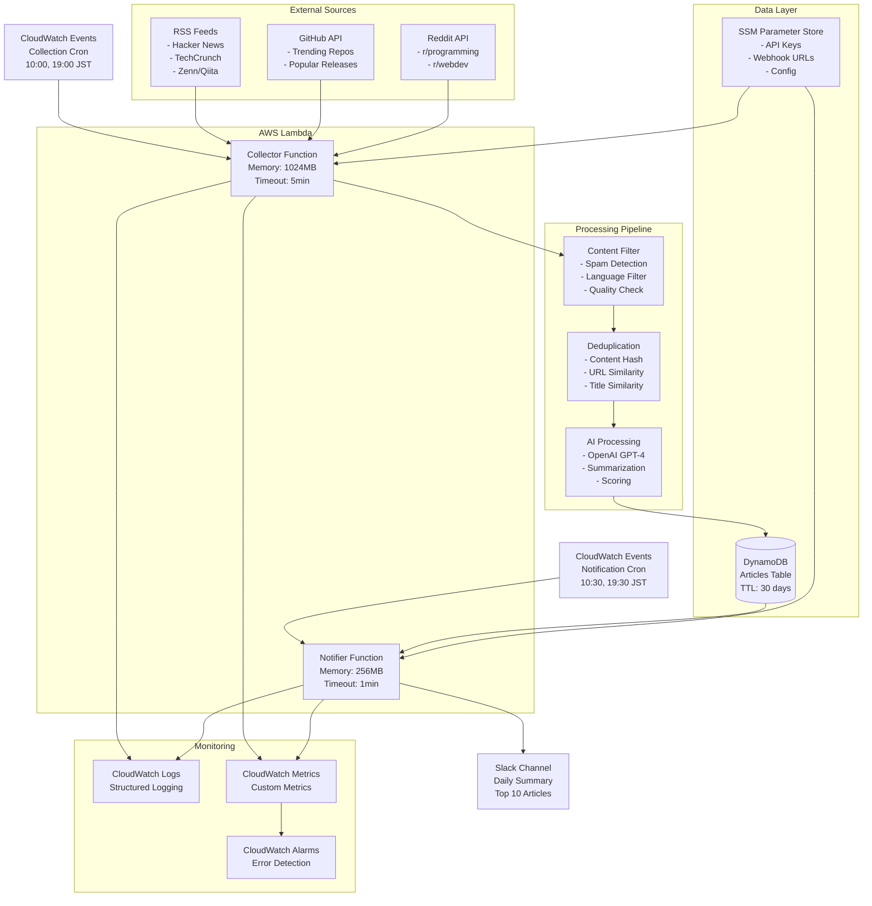

# Tech News Bot - アーキテクチャ詳細設計

## システムアーキテクチャ概要

### 全体構成図



## コンポーネント詳細設計

### 1. データ収集層 (Collection Layer)

#### 1.1 Collector Lambda Function

**実行仕様:**
- Runtime: Python 3.11
- Memory: 1024MB
- Timeout: 5分
- 実行頻度: 1日2回 (10:00, 19:00 JST)

**処理フロー:**
```python
def collector_handler(event, context):
    """
    記事収集のメインエントリーポイント
    """
    # 1. 各データソースから並行収集
    with ThreadPoolExecutor(max_workers=3) as executor:
        futures = [
            executor.submit(RSSCollector().collect),
            executor.submit(GitHubCollector().collect),
            executor.submit(RedditCollector().collect)
        ]
        
        all_articles = []
        for future in as_completed(futures):
            articles = future.result()
            all_articles.extend(articles)
    
    # 2. データ処理パイプライン
    filtered_articles = ContentFilter().filter(all_articles)
    unique_articles = Deduplicator().remove_duplicates(filtered_articles)
    processed_articles = AIProcessor().process(unique_articles)
    
    # 3. データベース保存
    ArticleStore().bulk_save(processed_articles)
    
    return {
        "statusCode": 200,
        "collected": len(all_articles),
        "processed": len(processed_articles)
    }
```

#### 1.2 データソース詳細

**RSS Collector:**
```python
class RSSCollector(BaseCollector):
    FEEDS = [
        {
            "url": "https://hnrss.org/frontpage",
            "source": "hackernews",
            "weight": 0.9,
            "language": "en"
        },
        {
            "url": "https://japan.techcrunch.com/feed/",
            "source": "techcrunch",
            "weight": 0.8,
            "language": "ja"
        },
        {
            "url": "https://zenn.dev/feed",
            "source": "zenn",
            "weight": 0.7,
            "language": "ja"
        }
    ]
    
    def collect(self) -> List[Article]:
        articles = []
        for feed_config in self.FEEDS:
            try:
                feed = feedparser.parse(feed_config["url"])
                for entry in feed.entries:
                    article = self._parse_entry(entry, feed_config)
                    if self._is_recent(article) and self._is_tech_related(article):
                        articles.append(article)
            except Exception as e:
                logger.error(f"RSS collection failed: {feed_config['url']}", error=str(e))
        
        return articles
```

**GitHub Collector:**
```python
class GitHubCollector(BaseCollector):
    def collect(self) -> List[Article]:
        articles = []
        
        # GitHub Trending repositories
        trending_repos = self._get_trending_repositories()
        for repo in trending_repos:
            article = Article(
                title=f"📈 Trending: {repo['full_name']}",
                url=repo['html_url'],
                summary=repo['description'],
                published_at=datetime.fromisoformat(repo['created_at']),
                source="github_trending",
                tags=repo['topics'] + ["github", "trending"],
                score=self._calculate_github_score(repo)
            )
            articles.append(article)
        
        # Popular releases
        recent_releases = self._get_popular_releases()
        for release in recent_releases:
            article = self._create_release_article(release)
            articles.append(article)
        
        return articles
    
    def _calculate_github_score(self, repo: dict) -> float:
        """GitHub リポジトリのスコア計算"""
        stars = repo.get('stargazers_count', 0)
        forks = repo.get('forks_count', 0)
        language = repo.get('language', '')
        
        # 基本スコア (star数ベース)
        base_score = min(stars / 10000, 0.8)
        
        # 言語ボーナス
        tech_languages = ['Python', 'JavaScript', 'TypeScript', 'Go', 'Rust']
        language_bonus = 0.1 if language in tech_languages else 0
        
        # フォーク率ボーナス
        fork_ratio = forks / max(stars, 1)
        fork_bonus = min(fork_ratio * 0.1, 0.1)
        
        return min(base_score + language_bonus + fork_bonus, 1.0)
```

**Reddit Collector:**
```python
class RedditCollector(BaseCollector):
    SUBREDDITS = [
        {"name": "programming", "weight": 0.8},
        {"name": "webdev", "weight": 0.7},
        {"name": "MachineLearning", "weight": 0.9},
        {"name": "technology", "weight": 0.6}
    ]
    
    def collect(self) -> List[Article]:
        reddit = praw.Reddit(
            client_id=self.config.reddit_client_id,
            client_secret=self.config.reddit_client_secret,
            user_agent="TechNewsBot/1.0"
        )
        
        articles = []
        for sub_config in self.SUBREDDITS:
            subreddit = reddit.subreddit(sub_config["name"])
            
            # 人気投稿を取得 (24時間以内)
            for submission in subreddit.hot(limit=20):
                if self._is_recent_submission(submission):
                    article = self._create_reddit_article(submission, sub_config)
                    articles.append(article)
        
        return articles
    
    def _calculate_reddit_score(self, submission, weight: float) -> float:
        """Reddit 投稿のスコア計算"""
        upvotes = submission.score
        comments = submission.num_comments
        ratio = submission.upvote_ratio
        
        # 基本スコア
        base_score = min(upvotes / 1000, 0.7)
        
        # コメント数ボーナス
        comment_bonus = min(comments / 100 * 0.1, 0.2)
        
        # アップヴォート率ボーナス
        ratio_bonus = (ratio - 0.5) * 0.2
        
        return min((base_score + comment_bonus + ratio_bonus) * weight, 1.0)
```

### 2. データ処理層 (Processing Layer)

#### 2.1 Content Filter

```python
class ContentFilter:
    """コンテンツフィルタリング"""
    
    TECH_KEYWORDS = [
        'python', 'javascript', 'react', 'ai', 'machine learning',
        'kubernetes', 'docker', 'aws', 'api', 'framework',
        'open source', 'github', 'programming', 'development'
    ]
    
    SPAM_PATTERNS = [
        r'win \$\d+',
        r'click here',
        r'limited time offer',
        r'buy now'
    ]
    
    def filter(self, articles: List[Article]) -> List[Article]:
        """記事をフィルタリング"""
        filtered = []
        
        for article in articles:
            if self._is_tech_related(article) and not self._is_spam(article):
                filtered.append(article)
        
        return filtered
    
    def _is_tech_related(self, article: Article) -> bool:
        """テック関連記事かどうか判定"""
        content = f"{article.title} {article.summary}".lower()
        
        # キーワードマッチング
        keyword_score = sum(1 for keyword in self.TECH_KEYWORDS if keyword in content)
        
        # タグベースの判定
        tech_tags = {'programming', 'tech', 'ai', 'ml', 'web', 'mobile'}
        tag_score = len(set(article.tags) & tech_tags)
        
        return keyword_score >= 1 or tag_score >= 1
    
    def _is_spam(self, article: Article) -> bool:
        """スパム記事かどうか判定"""
        content = f"{article.title} {article.summary}".lower()
        
        for pattern in self.SPAM_PATTERNS:
            if re.search(pattern, content, re.IGNORECASE):
                return True
        
        return False
```

#### 2.2 Deduplicator

```python
class Deduplicator:
    """重複除去処理"""
    
    def remove_duplicates(self, articles: List[Article]) -> List[Article]:
        """記事の重複を除去"""
        seen_hashes = set()
        unique_articles = []
        
        # 既存記事のハッシュを取得
        existing_hashes = self._get_existing_hashes()
        seen_hashes.update(existing_hashes)
        
        for article in articles:
            content_hash = self._generate_content_hash(article)
            article.content_hash = content_hash
            
            if content_hash not in seen_hashes:
                # URL類似性チェック
                if not self._is_similar_url_exists(article, unique_articles):
                    unique_articles.append(article)
                    seen_hashes.add(content_hash)
        
        return unique_articles
    
    def _generate_content_hash(self, article: Article) -> str:
        """コンテンツハッシュ生成"""
        content = f"{article.title}{article.url}"
        return hashlib.sha256(content.encode()).hexdigest()[:16]
    
    def _is_similar_url_exists(self, article: Article, existing: List[Article]) -> bool:
        """類似URLの存在チェック"""
        from difflib import SequenceMatcher
        
        for existing_article in existing:
            similarity = SequenceMatcher(None, article.url, existing_article.url).ratio()
            if similarity > 0.8:  # 80%以上の類似度
                return True
        
        return False
```

#### 2.3 AI Processor

```python
class AIProcessor:
    """AI を使用した記事処理"""
    
    def __init__(self):
        self.openai_client = OpenAI(api_key=config.openai_api_key)
    
    def process(self, articles: List[Article]) -> List[Article]:
        """記事をAI処理"""
        processed_articles = []
        
        for article in articles:
            try:
                # 要約生成（要約がない場合のみ）
                if not article.summary or len(article.summary) < 50:
                    article.summary = self._generate_summary(article)
                
                # スコア計算
                article.score = self._calculate_ai_score(article)
                
                # タグ拡充
                article.tags.extend(self._extract_ai_tags(article))
                
                processed_articles.append(article)
                
            except Exception as e:
                logger.error(f"AI processing failed for article: {article.title}", error=str(e))
                # AI処理失敗時はそのまま追加
                processed_articles.append(article)
        
        return processed_articles
    
    def _generate_summary(self, article: Article) -> str:
        """記事要約を生成"""
        prompt = f"""
        以下の技術記事のタイトルとURLから、日本語で簡潔な要約（50-100文字）を作成してください。
        技術的な内容を重視し、読者にとって有益な情報を含めてください。
        
        タイトル: {article.title}
        URL: {article.url}
        """
        
        response = self.openai_client.chat.completions.create(
            model="gpt-4o-mini",
            messages=[{"role": "user", "content": prompt}],
            max_tokens=150,
            temperature=0.3
        )
        
        return response.choices[0].message.content.strip()
    
    def _calculate_ai_score(self, article: Article) -> float:
        """AI による記事スコア計算"""
        prompt = f"""
        以下の技術記事の重要度を0.0〜1.0のスコアで評価してください。
        評価基準:
        - 技術的新規性・革新性
        - 実用性・有用性
        - 影響力・話題性
        - 情報の信頼性
        
        タイトル: {article.title}
        要約: {article.summary}
        ソース: {article.source}
        
        数値のみ返答してください（例: 0.75）
        """
        
        try:
            response = self.openai_client.chat.completions.create(
                model="gpt-4o-mini",
                messages=[{"role": "user", "content": prompt}],
                max_tokens=10,
                temperature=0.1
            )
            
            score_text = response.choices[0].message.content.strip()
            return float(score_text)
            
        except Exception:
            # AI スコア計算失敗時は基本スコアを使用
            return self._calculate_basic_score(article)
    
    def _calculate_basic_score(self, article: Article) -> float:
        """基本的なスコア計算（AI失敗時のフォールバック）"""
        score = 0.5  # ベーススコア
        
        # ソース別重み付け
        source_weights = {
            'hackernews': 0.9,
            'github_trending': 0.8,
            'techcrunch': 0.7,
            'zenn': 0.6,
            'reddit': 0.5
        }
        
        source_weight = source_weights.get(article.source, 0.5)
        score *= source_weight
        
        # タイトル長ボーナス（適度な長さ）
        title_len = len(article.title)
        if 20 <= title_len <= 100:
            score += 0.1
        
        return min(score, 1.0)
```

### 3. データ保存層 (Storage Layer)

#### 3.1 DynamoDB テーブル設計

```yaml
Table: tech-news-articles
Properties:
  BillingMode: PAY_PER_REQUEST
  
Attributes:
  date: String (YYYY-MM-DD) # Partition Key
  article_id: String (UUID) # Sort Key
  title: String
  url: String
  summary: String
  published_at: Number (Unix timestamp)
  source: String
  tags: List
  score: Number (0.0-1.0)
  content_hash: String
  author: String (Optional)
  ttl: Number (自動削除用)

Global Secondary Indexes:
  1. source-published_at-index
     - PK: source
     - SK: published_at
     - Purpose: ソース別の記事取得
  
  2. content-hash-index
     - PK: content_hash
     - Purpose: 重複検出
  
  3. score-index
     - PK: date
     - SK: score
     - Purpose: 高スコア記事の取得
```

#### 3.2 Article Store Implementation

```python
class ArticleStore:
    """DynamoDB を使用した記事ストレージ"""
    
    def __init__(self):
        self.dynamodb = boto3.resource('dynamodb')
        self.table = self.dynamodb.Table(config.dynamodb_table)
    
    def bulk_save(self, articles: List[Article]) -> int:
        """記事を一括保存"""
        saved_count = 0
        
        with self.table.batch_writer() as batch:
            for article in articles:
                try:
                    item = self._article_to_dynamodb_item(article)
                    batch.put_item(Item=item)
                    saved_count += 1
                except Exception as e:
                    logger.error(f"Failed to save article: {article.title}", error=str(e))
        
        return saved_count
    
    def get_articles_by_date(self, date: datetime.date, min_score: float = 0.0) -> List[Article]:
        """日付指定で記事を取得"""
        date_str = date.strftime('%Y-%m-%d')
        
        response = self.table.query(
            KeyConditionExpression=Key('date').eq(date_str),
            FilterExpression=Attr('score').gte(min_score),
            ScanIndexForward=False  # 新しい順
        )
        
        articles = []
        for item in response['Items']:
            article = self._dynamodb_item_to_article(item)
            articles.append(article)
        
        return articles
    
    def get_existing_hashes(self, days: int = 7) -> Set[str]:
        """過去N日間の記事ハッシュを取得"""
        hashes = set()
        
        for i in range(days):
            date = datetime.date.today() - datetime.timedelta(days=i)
            date_str = date.strftime('%Y-%m-%d')
            
            response = self.table.query(
                KeyConditionExpression=Key('date').eq(date_str),
                ProjectionExpression='content_hash'
            )
            
            for item in response['Items']:
                hashes.add(item['content_hash'])
        
        return hashes
    
    def _article_to_dynamodb_item(self, article: Article) -> dict:
        """Article を DynamoDB アイテムに変換"""
        date_str = article.published_at.strftime('%Y-%m-%d')
        ttl = int((datetime.now() + timedelta(days=30)).timestamp())
        
        return {
            'date': date_str,
            'article_id': str(uuid.uuid4()),
            'title': article.title,
            'url': article.url,
            'summary': article.summary,
            'published_at': int(article.published_at.timestamp()),
            'source': article.source,
            'tags': article.tags,
            'score': Decimal(str(article.score)),
            'content_hash': article.content_hash,
            'author': article.author,
            'ttl': ttl
        }
```

### 4. 通知層 (Notification Layer)

#### 4.1 Notifier Lambda Function

```python
def notifier_handler(event, context):
    """Slack通知のメインハンドラー"""
    
    # 本日の高スコア記事を取得
    article_store = ArticleStore()
    today_articles = article_store.get_articles_by_date(
        datetime.date.today(),
        min_score=0.6  # スコア0.6以上
    )
    
    if not today_articles:
        logger.info("No articles to notify")
        return {"statusCode": 200, "message": "No articles"}
    
    # スコア順でソート
    sorted_articles = sorted(today_articles, key=lambda x: x.score, reverse=True)
    top_articles = sorted_articles[:10]  # 上位10記事
    
    # 時間帯による分類
    current_hour = datetime.now().hour
    if current_hour < 12:
        notification_type = "morning"
        title = "🌅 今日のテックニュース（朝刊）"
    else:
        notification_type = "evening"
        title = "🌆 今日のテックニュース（夕刊）"
    
    # Slack通知
    slack_notifier = SlackNotifier()
    success = slack_notifier.send_daily_summary(top_articles, title, notification_type)
    
    # メトリクス送信
    cloudwatch = boto3.client('cloudwatch')
    cloudwatch.put_metric_data(
        Namespace='TechNewsBot',
        MetricData=[
            {
                'MetricName': 'NotificationsSent',
                'Value': 1 if success else 0,
                'Unit': 'Count',
                'Dimensions': [
                    {'Name': 'Type', 'Value': notification_type}
                ]
            },
            {
                'MetricName': 'ArticlesNotified',
                'Value': len(top_articles),
                'Unit': 'Count'
            }
        ]
    )
    
    return {
        "statusCode": 200 if success else 500,
        "articles_sent": len(top_articles),
        "notification_type": notification_type
    }
```

#### 4.2 Slack Notifier Implementation

```python
class SlackNotifier:
    """Slack 通知処理"""
    
    def __init__(self):
        self.webhook_url = config.slack_webhook_url
    
    def send_daily_summary(self, articles: List[Article], title: str, notification_type: str) -> bool:
        """日次サマリーをSlackに送信"""
        
        # ヘッダーブロック
        blocks = [
            {
                "type": "header",
                "text": {
                    "type": "plain_text",
                    "text": title
                }
            },
            {
                "type": "context",
                "elements": [
                    {
                        "type": "mrkdwn",
                        "text": f"📊 {len(articles)}件の記事をお届けします"
                    }
                ]
            },
            {"type": "divider"}
        ]
        
        # 記事ブロック
        for i, article in enumerate(articles, 1):
            blocks.extend(self._create_article_blocks(article, i))
            
            # 5記事ごとに区切り線
            if i % 5 == 0 and i < len(articles):
                blocks.append({"type": "divider"})
        
        # フッターブロック
        blocks.extend([
            {"type": "divider"},
            {
                "type": "context",
                "elements": [
                    {
                        "type": "mrkdwn",
                        "text": f"🤖 Tech News Bot | {datetime.now().strftime('%Y-%m-%d %H:%M')}"
                    }
                ]
            }
        ])
        
        payload = {
            "blocks": blocks,
            "username": "Tech News Bot",
            "icon_emoji": ":newspaper:"
        }
        
        try:
            response = requests.post(
                self.webhook_url,
                json=payload,
                timeout=10
            )
            
            if response.status_code == 200:
                logger.info(f"Successfully sent {len(articles)} articles to Slack")
                return True
            else:
                logger.error(f"Slack notification failed: {response.status_code}")
                return False
                
        except Exception as e:
            logger.error(f"Slack notification error: {str(e)}")
            return False
    
    def _create_article_blocks(self, article: Article, index: int) -> List[dict]:
        """個別記事のSlackブロックを作成"""
        
        # スコアに応じた絵文字
        if article.score >= 0.9:
            score_emoji = "🔥"
        elif article.score >= 0.8:
            score_emoji = "⭐"
        elif article.score >= 0.7:
            score_emoji = "👍"
        else:
            score_emoji = "📄"
        
        # ソース絵文字マッピング
        source_emojis = {
            'hackernews': '🟠',
            'github_trending': '🐙',
            'techcrunch': '🟢',
            'zenn': '🇯🇵',
            'reddit': '🔶'
        }
        source_emoji = source_emojis.get(article.source, '📰')
        
        # タグの表示（最大3個）
        tag_text = ""
        if article.tags:
            displayed_tags = article.tags[:3]
            tag_text = " | " + " ".join([f"`{tag}`" for tag in displayed_tags])
        
        return [
            {
                "type": "section",
                "text": {
                    "type": "mrkdwn",
                    "text": f"{score_emoji} *{index}. {article.title}*\n{article.summary}"
                },
                "accessory": {
                    "type": "button",
                    "text": {
                        "type": "plain_text",
                        "text": "Read More",
                        "emoji": True
                    },
                    "url": article.url,
                    "action_id": f"read_article_{index}"
                }
            },
            {
                "type": "context",
                "elements": [
                    {
                        "type": "mrkdwn",
                        "text": f"{source_emoji} {article.source} | Score: {article.score:.2f}{tag_text}"
                    }
                ]
            }
        ]
```

### 5. 監視・運用層 (Monitoring Layer)

#### 5.1 CloudWatch カスタムメトリクス

```python
class MetricsCollector:
    """カスタムメトリクス収集"""
    
    def __init__(self):
        self.cloudwatch = boto3.client('cloudwatch')
    
    def send_collection_metrics(self, source: str, articles_count: int, processing_time: float, errors: int = 0):
        """収集メトリクスを送信"""
        self.cloudwatch.put_metric_data(
            Namespace='TechNewsBot/Collection',
            MetricData=[
                {
                    'MetricName': 'ArticlesCollected',
                    'Dimensions': [{'Name': 'Source', 'Value': source}],
                    'Value': articles_count,
                    'Unit': 'Count',
                    'Timestamp': datetime.utcnow()
                },
                {
                    'MetricName': 'ProcessingTime',
                    'Dimensions': [{'Name': 'Source', 'Value': source}],
                    'Value': processing_time,
                    'Unit': 'Seconds'
                },
                {
                    'MetricName': 'CollectionErrors',
                    'Dimensions': [{'Name': 'Source', 'Value': source}],
                    'Value': errors,
                    'Unit': 'Count'
                }
            ]
        )
    
    def send_processing_metrics(self, duplicates_removed: int, ai_failures: int, total_processed: int):
        """処理メトリクスを送信"""
        self.cloudwatch.put_metric_data(
            Namespace='TechNewsBot/Processing',
            MetricData=[
                {
                    'MetricName': 'DuplicatesRemoved',
                    'Value': duplicates_removed,
                    'Unit': 'Count'
                },
                {
                    'MetricName': 'AIProcessingFailures',
                    'Value': ai_failures,
                    'Unit': 'Count'
                },
                {
                    'MetricName': 'ArticlesProcessed',
                    'Value': total_processed,
                    'Unit': 'Count'
                }
            ]
        )
```

#### 5.2 CloudWatch アラーム設定

```yaml
# CloudFormation Template for Alarms
Resources:
  # 収集エラーアラーム
  CollectionErrorAlarm:
    Type: AWS::CloudWatch::Alarm
    Properties:
      AlarmName: TechNewsBot-CollectionErrors
      AlarmDescription: "High error rate in article collection"
      MetricName: Errors
      Namespace: AWS/Lambda
      Statistic: Sum
      Period: 300
      EvaluationPeriods: 1
      Threshold: 1
      ComparisonOperator: GreaterThanOrEqualToThreshold
      Dimensions:
        - Name: FunctionName
          Value: !Ref CollectorFunction
      AlarmActions:
        - !Ref SNSAlertTopic
  
  # 記事収集数アラーム
  NoArticlesAlarm:
    Type: AWS::CloudWatch::Alarm
    Properties:
      AlarmName: TechNewsBot-NoArticlesCollected
      AlarmDescription: "No articles collected in recent execution"
      MetricName: ArticlesCollected
      Namespace: TechNewsBot/Collection
      Statistic: Sum
      Period: 3600
      EvaluationPeriods: 1
      Threshold: 5
      ComparisonOperator: LessThanThreshold
      TreatMissingData: breaching
      AlarmActions:
        - !Ref SNSAlertTopic
  
  # Lambda実行時間アラーム
  LongExecutionAlarm:
    Type: AWS::CloudWatch::Alarm
    Properties:
      AlarmName: TechNewsBot-LongExecution
      AlarmDescription: "Lambda execution time too long"
      MetricName: Duration
      Namespace: AWS/Lambda
      Statistic: Average
      Period: 300
      EvaluationPeriods: 2
      Threshold: 240000  # 4分
      ComparisonOperator: GreaterThanThreshold
      Dimensions:
        - Name: FunctionName
          Value: !Ref CollectorFunction
```

#### 5.3 構造化ログ実装

```python
import structlog
import json
from datetime import datetime

# ログ設定
structlog.configure(
    processors=[
        structlog.stdlib.filter_by_level,
        structlog.stdlib.add_logger_name,
        structlog.stdlib.add_log_level,
        structlog.stdlib.PositionalArgumentsFormatter(),
        structlog.dev.ConsoleRenderer() if DEBUG else structlog.processors.JSONRenderer()
    ],
    wrapper_class=structlog.stdlib.LoggerFactory(),
    context_class=dict,
    logger_factory=structlog.stdlib.LoggerFactory(),
    cache_logger_on_first_use=True,
)

logger = structlog.get_logger()

# 使用例
class BaseCollector:
    def __init__(self):
        self.logger = structlog.get_logger(self.__class__.__name__)
    
    def collect(self) -> List[Article]:
        start_time = time.time()
        
        try:
            articles = self._do_collect()
            processing_time = time.time() - start_time
            
            self.logger.info(
                "collection_completed",
                source=self.source_name,
                articles_collected=len(articles),
                processing_time_seconds=processing_time,
                success=True
            )
            
            return articles
            
        except Exception as e:
            processing_time = time.time() - start_time
            
            self.logger.error(
                "collection_failed",
                source=self.source_name,
                error=str(e),
                error_type=type(e).__name__,
                processing_time_seconds=processing_time,
                success=False
            )
            
            raise
```

## パフォーマンス最適化

### 1. 並行処理の実装

```python
import asyncio
import aiohttp
from concurrent.futures import ThreadPoolExecutor, as_completed

class AsyncCollector:
    """非同期データ収集"""
    
    async def collect_all_sources(self) -> List[Article]:
        """全ソースから並行収集"""
        
        tasks = [
            self.collect_rss_async(),
            self.collect_github_async(),
            self.collect_reddit_async()
        ]
        
        results = await asyncio.gather(*tasks, return_exceptions=True)
        
        all_articles = []
        for result in results:
            if isinstance(result, Exception):
                logger.error(f"Collection failed: {result}")
            else:
                all_articles.extend(result)
        
        return all_articles
    
    async def collect_rss_async(self) -> List[Article]:
        """RSS非同期収集"""
        async with aiohttp.ClientSession() as session:
            tasks = []
            
            for feed_config in RSS_FEEDS:
                task = self.fetch_rss_feed(session, feed_config)
                tasks.append(task)
            
            results = await asyncio.gather(*tasks, return_exceptions=True)
            
            articles = []
            for result in results:
                if not isinstance(result, Exception):
                    articles.extend(result)
            
            return articles
```

### 2. キャッシュ戦略

```python
import redis
from functools import wraps

class CacheManager:
    """Redis キャッシュマネージャー"""
    
    def __init__(self):
        self.redis_client = redis.Redis(
            host=config.redis_host,
            port=config.redis_port,
            decode_responses=True
        )
    
    def cache_articles(self, key: str, articles: List[Article], ttl: int = 3600):
        """記事をキャッシュ"""
        serialized = json.dumps([article.__dict__ for article in articles], default=str)
        self.redis_client.setex(key, ttl, serialized)
    
    def get_cached_articles(self, key: str) -> Optional[List[Article]]:
        """キャッシュから記事を取得"""
        cached = self.redis_client.get(key)
        if cached:
            data = json.loads(cached)
            return [Article(**item) for item in data]
        return None

def cache_result(cache_key: str, ttl: int = 3600):
    """デコレータ：結果をキャッシュ"""
    def decorator(func):
        @wraps(func)
        def wrapper(*args, **kwargs):
            cache_manager = CacheManager()
            
            # キャッシュチェック
            cached_result = cache_manager.get_cached_articles(cache_key)
            if cached_result:
                return cached_result
            
            # 実行 & キャッシュ
            result = func(*args, **kwargs)
            cache_manager.cache_articles(cache_key, result, ttl)
            
            return result
        return wrapper
    return decorator
```

### 3. バッチ処理最適化

```python
class BatchProcessor:
    """バッチ処理最適化"""
    
    def __init__(self, batch_size: int = 25):
        self.batch_size = batch_size
    
    def process_articles_in_batches(self, articles: List[Article]) -> List[Article]:
        """記事をバッチ処理"""
        processed_articles = []
        
        for i in range(0, len(articles), self.batch_size):
            batch = articles[i:i + self.batch_size]
            batch_result = self._process_batch(batch)
            processed_articles.extend(batch_result)
            
            # レート制限対応
            time.sleep(0.1)
        
        return processed_articles
    
    def _process_batch(self, batch: List[Article]) -> List[Article]:
        """バッチ単位の処理"""
        with ThreadPoolExecutor(max_workers=5) as executor:
            futures = []
            
            for article in batch:
                future = executor.submit(self._process_single_article, article)
                futures.append(future)
            
            results = []
            for future in as_completed(futures):
                try:
                    result = future.result(timeout=30)
                    results.append(result)
                except Exception as e:
                    logger.error(f"Batch processing failed: {e}")
            
            return results
```

この詳細設計により、スケーラブルで保守性の高いテックニュース収集システムを構築できます。各コンポーネントは独立性を保ちながら、効率的に連携する設計となっています。